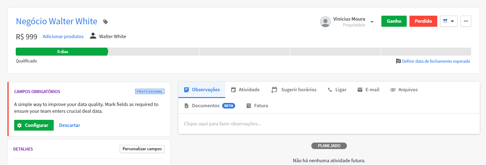

# LinkAPI Back End Challenge

This repository is part of process to ingress on LinkAPI's team.

## Installation

You can use the package manager [yarn](https://yarnpkg.com/) .

```bash
yarn install
```
for [npm](https://www.npmjs.com/) .

```bash
npm install
```

## Configuration

Copy the .env.example file as .env
then set the variables


```bash
PIPEDRIVE_API_TOKEN # Pipedrive Api Token for fetch deals
BLING_API_KEY # Bling Api Key for post new Orders
BLING_API_URL # Base Api Url of Bling
DATABASE_CONNECTION # Your mongodb connection url
TEST_DATABASE_CONNECTION # Your mongodb connection url to test database
```

## Usage
Run the system
```bash
yarn start
```
or

```bash
npm start
```
On Pipdrive create a new deal


And set then as won 


On Bling, go to 'Pedidos de Venda' and await to new integrated deals


To get the already integrated deals storeds on app, go to route
```bash
/deals
```
A list of deals will show:
```bash
[
 {
  "_id": "5f9b3cc8a256db2a94bc0e4b",
  "name": "Vinicius",
  "description": "Negócio ViniMoura-1",
  "value": 275,
  "date": "2020-10-30T01:05:34.000Z",
  "pipedrive_id": 1,
  "bling_id": 9984462060,
  "createdAt": "2020-10-29T22:06:00.886Z",
  "updatedAt": "2020-10-29T22:06:00.886Z",
  "__v": 0
 }
]
```
You can get a specifc deal passing the 'id' of deal

```bash
/deals/5f9b3cc8a256db2a94bc0e4b
```
```bash
{
    "_id": "5f9b3cc8a256db2a94bc0e4b",
    "name": "Vinicius",
    "description": "Negócio ViniMoura-1",
    "value": 275,
    "date": "2020-10-30T01:05:34.000Z",
    "pipedrive_id": 1,
    "bling_id": 9984462060,
    "createdAt": "2020-10-29T22:06:00.886Z",
    "updatedAt": "2020-10-29T22:06:00.886Z",
    "__v": 0
}
```
The route
```bash
/deals/reports
```
Return a list of amount integrated grouped by day
```bash
[
    {
        "date": "29/10/2020",
        "value": 7735.66
    },
    {
        "date": "30/10/2020",
        "value": 3366
    }
]
```
## Contributing
Pull requests are welcome. For major changes, please open an issue first to discuss what you would like to change.

Please make sure to update tests as appropriate.

## License
[MIT](https://choosealicense.com/licenses/mit/)